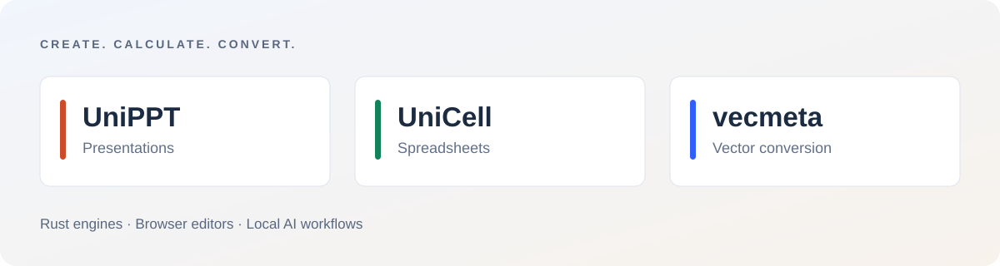
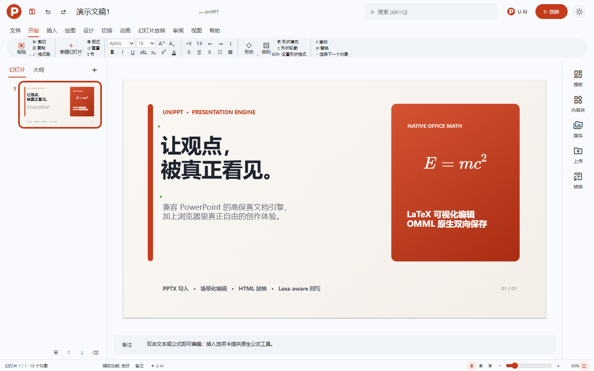
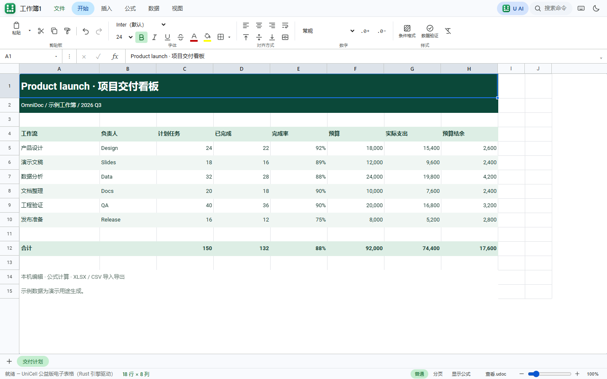

<div align="center">

# OmniDocX

**An office platform for the AI era. From documents to applications.**

**English** | [简体中文](README.zh-CN.md)

[Website](https://omnidoc.top/) · [Quick start](#quick-start) · [Documentation](#documentation) · [Benchmarks](benchmarks/README.md)

[](https://github.com/OmniDocX/omnidocx/actions/workflows/ci.yml)
[](LICENSE)
[](https://github.com/OmniDocX/omnidocx/issues)

</div>

OmniDoc is building an office platform for the AI era. At its core is UniDoc: a dynamic document editor that brings text, layout, formulas, data and interaction into one document. Our product family spans documents, spreadsheets, presentations, images and email.

From inscriptions on stone and bone to paper, print and digital files, the tools people use to express ideas have continued to evolve. With UniDoc, we want to take the next step: documents that can contain live data, calculations and interactive applications.

**What you see is what you get. What you see can be an application.**

Developed in China, OmniDoc invests in its core products and document formats, addressing the office workflows served by Microsoft 365 and WPS Office while expanding cross-platform access.

This repository publishes source code for **UniPPT, UniCell and vecmeta**, with independent build instructions and performance measurements. UniDoc and our full product family are available online.

[Try UniDoc](https://app.unidoc.top/) · [OmniDoc](https://omnidoc.top/) · [Our product vision](docs/VISION.md)



## Choose your tools

| Project | Use it for | Get started |
| --- | --- | --- |
| **UniPPT** | Editable presentations, PPTX conversion and AI workflows | [Docs](projects/UniPPT/README.md) · [GitHub](https://github.com/OmniDocX/UniPPT) |
| **UniCell** | Local spreadsheets, formulas and Excel / CSV workflows | [Docs](projects/unicell/README.md) · [GitHub](https://github.com/OmniDocX/unicell) |
| **vecmeta** | Rust SVG ↔ EMF libraries and CLI | [Docs](projects/vecmeta/README.md) · [GitHub](https://github.com/OmniDocX/vecmeta) |

<table>
  <tr>
    <td width="50%"><a href="projects/UniPPT/README.md"></a></td>
    <td width="50%"><a href="projects/unicell/README.md"></a></td>
  </tr>
  <tr><td align="center"><strong>UniPPT</strong></td><td align="center"><strong>UniCell</strong></td></tr>
</table>

## Why this collection

- **Start with working applications** — Build browser-based presentation and spreadsheet editors with import, editing, calculation and export workflows.
- **Connect AI workflows** — Explore local MCP, native document operations and configurable model integration through existing application interfaces.
- **Explore format engines** — Follow PPTX / XLSX processing down to the Rust vector conversion layer.
- **Source with supporting evidence** — Each component includes build instructions, licensing and measurements, with pinned origins for reproducibility.

## Quick start

Clone the repository, then start the component you need. Each component runs independently:

```sh
git clone https://github.com/OmniDocX/omnidocx.git
cd omnidocx
```

**Presentations · UniPPT**

```sh
cd projects/UniPPT
cargo run --release --locked -p unippt-server
```

http://127.0.0.1:8141

<details>
<summary>Start UniCell or build vecmeta</summary>

Run each block from the collection root:

```sh
cd projects/unicell
cargo run --release --locked --manifest-path server/Cargo.toml
```

http://127.0.0.1:8143

```sh
cd projects/vecmeta
cargo build --release --locked -p emfsvg-cli
```

</details>

Git, Rust and a modern browser are required. Each project documents its toolchain version, platform dependencies and optional AI setup.

## Performance at a glance

<!-- BENCHMARK:START -->
| Project | Workload | Median |
| --- | --- | --- |
| UniPPT | 100-slide PPTX export | **139.41 ms** |
| UniCell | 10,000-row CSV import + calculation; 20,000 formulas | **660.92 ms** |
| vecmeta | 10,000-primitive SVG → EMF | **105.80 ms** |

2026-09-16 · Windows 10 · Intel i7-1165G7 · 31.7 GiB · Rust release · 2 warmups / 7 measurements. Synthetic workloads; no competitor speed comparison was performed.

[Full benchmarks and component observations](benchmarks/README.md)
<!-- BENCHMARK:END -->

## Edition and included source

This collection includes the single-user local editions of UniPPT and UniCell, plus vecmeta. PolyglotPDF is excluded. The public editions provide core editing and format processing without R2, cloud storage, collaboration, shared links or centralized accounts.

The `projects/` directories contain independently buildable source copies. [sources.lock.json](sources.lock.json) records upstream repositories, commits and file hashes. Run `python tools/verify_copies.py` to verify the copies.

## Documentation

| Guide | What it covers |
| --- | --- |
| [UniPPT](projects/UniPPT/README.md) | Editor, MCP, equations and exports |
| [UniCell](projects/unicell/README.md) | Workbooks, calculation, AI and file formats |
| [vecmeta](projects/vecmeta/README.md) | CLI, Rust APIs and compatibility |
| [OmniDoc](https://omnidoc.top/) | Product portal and applications |

## Online product family

[UniDoc](https://app.unidoc.top/) · [UniPPT](https://unippt.unidoc.top/) · [UniCell](https://unicell.unidoc.top/) · [UniMail](https://unimail.omnidoc.top/) · [UniPic](https://pic.unidoc.top/)

Hosted features and service availability are documented by each product.

## OmniDoc and community

[OmniDoc website](https://omnidoc.top/) · [UniPPT](https://github.com/OmniDocX/UniPPT) · [UniCell](https://github.com/OmniDocX/unicell) · [vecmeta](https://github.com/OmniDocX/vecmeta)

Share reproducible bugs and feature requests through [GitHub Issues](https://github.com/OmniDocX/omnidocx/issues). Contributions to features, format compatibility and documentation are welcome.

Microsoft 365 (Office 365) and WPS Office inform our office workflows; ONLYOFFICE and Univer are reference projects in the public office ecosystem. See [project positioning and capabilities](docs/COMPARISON.md).

## License and commercial licensing

First-party code uses [PolyForm Noncommercial 1.0.0](LICENSE). Noncommercial and specified institutional uses are free under its terms. Commercial uses outside those permissions require a [paid commercial license](docs/COMMERCIAL_LICENSE.md) and written authorization.

**Commercial contact: [cc@omnidoc.top](mailto:cc@omnidoc.top) · WeChat: 13184071590**

This is a source-available license, not an OSI-approved open-source license. Third-party terms and valid earlier grants remain independent. See [license scope](docs/LICENSING.md).
